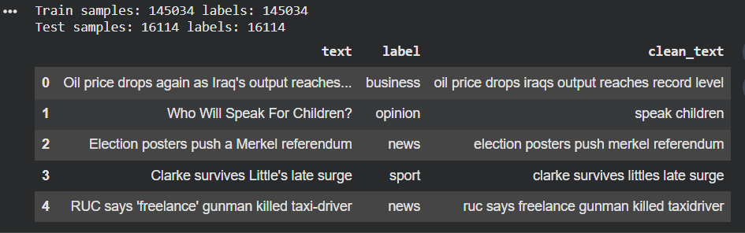
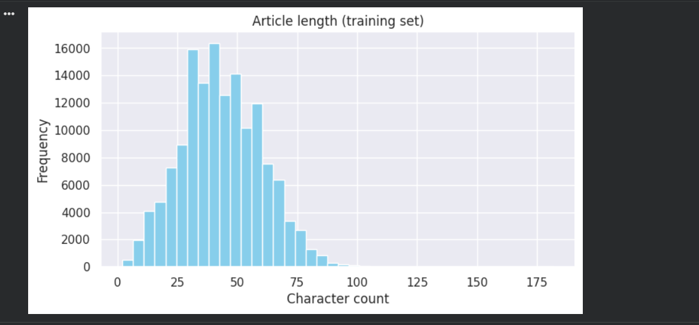
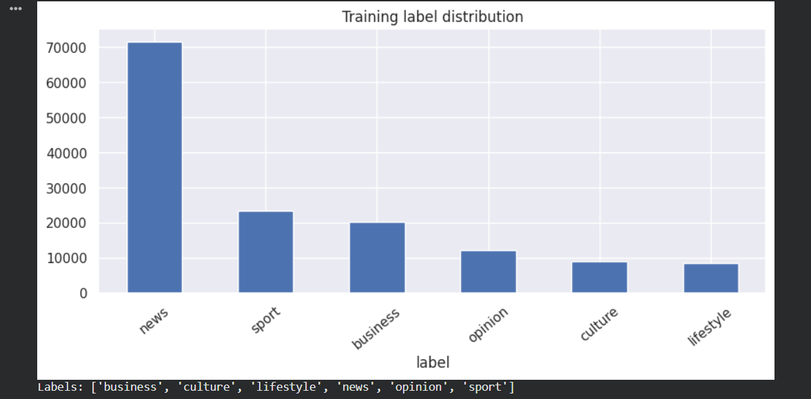
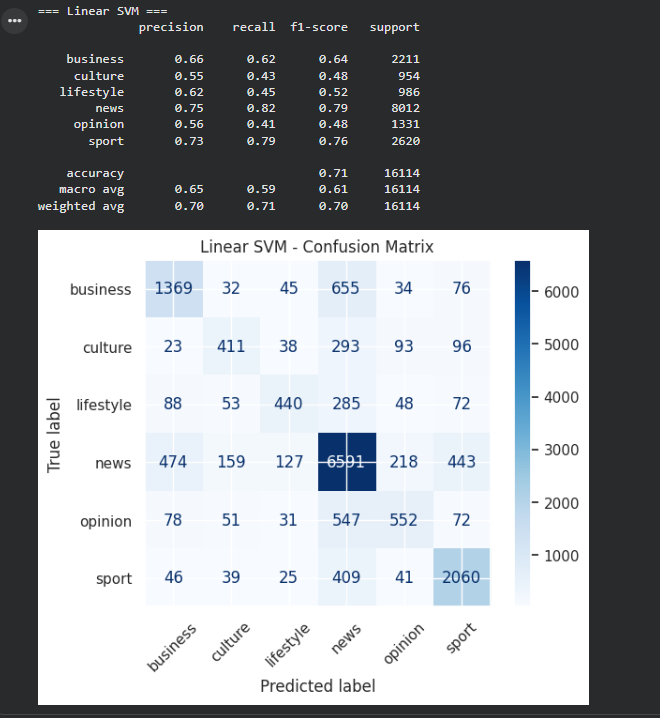
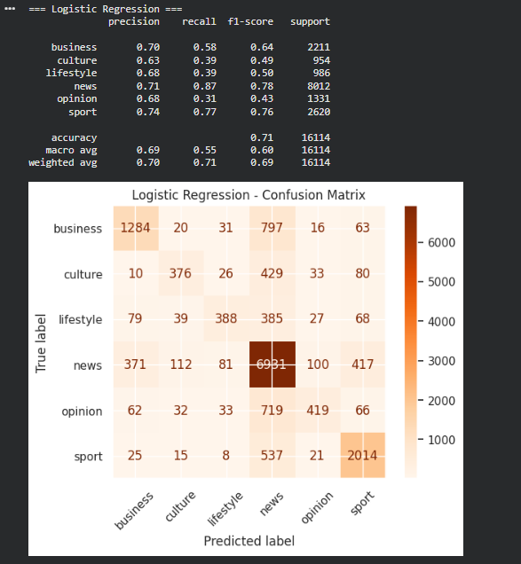
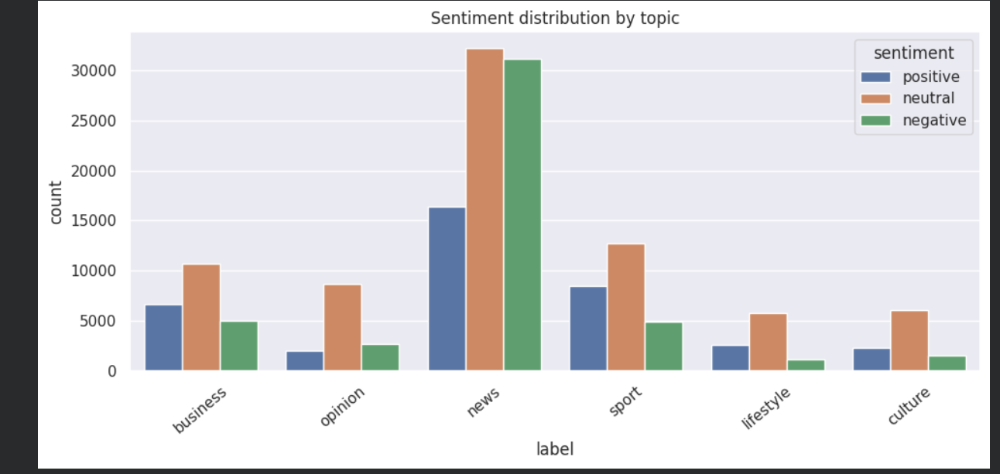

<div align="center">

# 🇮🇪 **Irish News NLP – Topic Classification & Sentiment Analysis**


</div>

---

## 🧠 **Project Overview**

This project builds a **complete NLP classification workflow** for Irish news by performing:

- High‑quality text cleaning  
- TF‑IDF feature extraction  
- Topic classification using **Linear SVM & Logistic Regression**  
- Sentiment analysis using **NLTK VADER**  
- Visual evaluation with confusion matrices, label distribution, and sentiment breakdown  

It uses the *Irish Times News Dataset* and processes thousands of real news articles.

---

## ⚙️ **Workflow Highlights**

### 🔹 Data Pipeline
- ZIP extraction  
- Raw text ingestion  
- Cleaning (URLs, numbers, punctuation, stopwords)

### 🔹 Feature Engineering
- TF‑IDF (20,000 max features, bi‑grams)

### 🔹 Model Building
- **Linear SVM**
- **Logistic Regression (max_iter=1000)**

### 🔹 Evaluation
- Classification reports  
- Confusion matrices  
- Weighted F1 score comparison  
- Sentiment distributions  

### 🔹 Extra Features
- Real‑time topic prediction function  
- Automatic sentiment tagging (positive/neutral/negative)

---

## 📁 **Project Structure**

```
Irish_News_NLP_Classification/
│
├── Screenshot/
│   ├── 01_dataset_preview_head.png
│   ├── 02_article_length_distribution.png
│   ├── 03_training_label_distribution.png
│   ├── 04_linear_svm_confusion_matrix.png
│   ├── 05_model_comparison_summary.png
│   ├── 06_sentiment_distribution_by_topic.png
│   ├── 4_logistic_regression_confusion_matrix.png
│
├── IrishTimes_News_Dataset.zip
├── Irish_News_NLP_Topic_Classification_+_Sentiment.ipynb
└── irish_news_nlp_topic_classification_+_sentiment.py
```

---

## 🚀 **How to Run the Project**

### 1️⃣ Install dependencies
```bash
pip install nltk pandas numpy scikit-learn matplotlib seaborn
```

### 2️⃣ Download NLTK resources
```python
nltk.download("stopwords")
nltk.download("vader_lexicon")
```

### 3️⃣ Run the script
```bash
python irish_news_nlp_topic_classification_+_sentiment.py
```

### 4️⃣ Or run the notebook
```bash
jupyter notebook Irish_News_NLP_Topic_Classification_+_Sentiment.ipynb
```

---

## 🖼️ **Screenshots & Visual Outputs**

### 📌 Dataset Preview  


### 📊 Article Length Distribution  


### 🏷️ Label Distribution  


### 🔵 Linear SVM – Confusion Matrix  


### 🟠 Logistic Regression – Confusion Matrix  


### 📈 Model Comparison Summary  


### 😊 Sentiment Distribution by Topic  


---

## 🔍 **Topic Prediction Helper**
```python
def predict_topic(text: str) -> str:
    cleaned = clean_text(text)
    vec = tfidf.transform([cleaned])
    pred = svm_model.predict(vec)[0]
    return pred
```

---

## 🎥 **Demo Video (To Be Added)**
*A section to embed your final demo link.*

---

## ✍️ **Author**
**Abinash Prasana**  
🇮🇪 NLP / Machine Learning Practice Project

